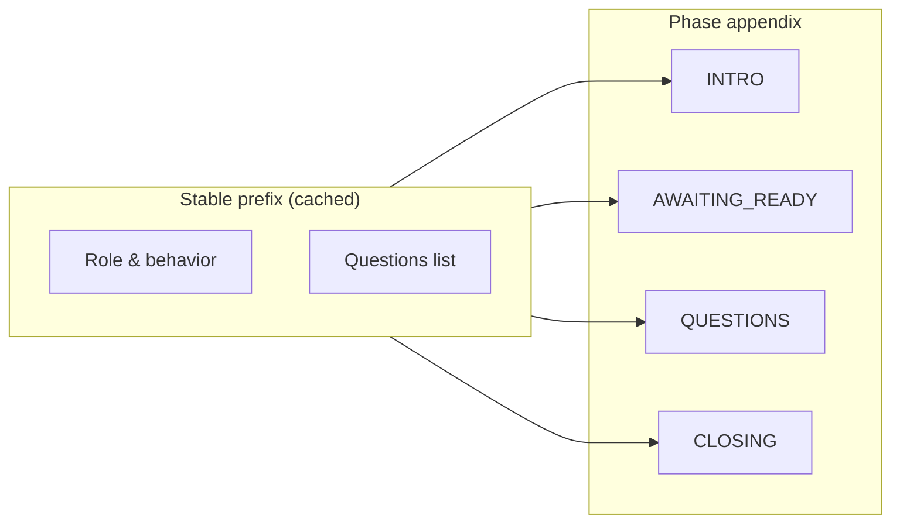

# Voice Interview — Prompting & Cost Optimization

Companion to [voice-interview-architecture.md](./voice-interview-architecture.md). Covers Realtime 2 prompt structure, session config, eval short-circuits, and observability.

## Prompt structure (Realtime 2)

`buildRealtimeInstructions()` in `packages/interview-realtime/prompts.ts` assembles labeled sections aligned with the [OpenAI Realtime prompting guide](https://platform.openai.com/docs/guides/realtime):

| Section | Purpose |
|---------|---------|
| Role and Objective | Interviewer role, position, round, candidate |
| Personality and Tone | Warm, professional, conversational |
| Language | English default |
| Reasoning | Fast acks; brief reasoning only for unclear audio |
| Preambles | Short spoken updates before transitions |
| Verbosity | 1–2 sentences for acks; full MCQ reading |
| Unclear Audio | Don't guess; ask to repeat; ignore silence/noise |
| Questions | Numbered list — **single source of truth** |
| Interview Flow | Phase-specific (intro / questions / closing) |

`response.create` payloads reference question **numbers** (e.g. "Question 3 from the session Questions list") instead of re-embedding full question text. MCQ option text stays in session instructions only.

## Session configuration

Sent via `session.update` on sideband connect and on phase transitions:

```json
{
  "type": "session.update",
  "session": {
    "reasoning": { "effort": "low" },
    "truncation": {
      "type": "retention_ratio",
      "retention_ratio": 0.7,
      "token_limits": { "post_instructions": 6000 }
    }
  }
}
```

Same truncation/reasoning defaults are applied when creating ephemeral client secrets in `packages/ai-config/realtime.ts`.

References:
- [Managing Realtime costs](https://developers.openai.com/api/docs/guides/realtime-costs)
- [Realtime client events — session.update](https://developers.openai.com/api/reference/resources/realtime/client-events/)

## Phase flow & dynamic session.update

The DO caches a stable **base instruction prefix** (role + questions list) and sends lightweight `session.update` events when `voicePhase` changes:

```
intro → awaiting_ready → questions → closing → awaiting_end
```

Only the **Interview Flow** appendix changes per phase; the Questions section stays identical for prompt-cache efficiency.



## Brief response token limits

| Event | `max_output_tokens` |
|-------|---------------------|
| Acknowledge answer | 80 |
| Intro follow-up | 120 |
| Noise follow-up | 120 |
| Closing | 150 |
| Ask question | (default — MCQs need more room) |

## Eval pipeline (Chat Completions)

Answer/intro evaluation uses `gpt-4o-mini` **only when heuristics are inconclusive**.

| Path | Trigger | API call? |
|------|---------|-----------|
| Noise short-circuit | `looksLikeNoise(utterance)` | No |
| Ready short-circuit (intro) | `looksLikeReadyConfirmation(utterance)` | No |
| Max retries exceeded | `followUpCount >= 3` | No — advance |
| Ambiguous intro | e.g. long non-ready speech | Yes |
| Substantive answer | passes noise check | Yes (confirms sufficient) |

Log grep: `"action":"noise_short_circuit"` or `"action":"ready_short_circuit"` in eval logs.

## cached_tokens observability

On each `response.done`, the DO parses `response.usage` and logs token fields on `response_metrics` and `response_done`:

```bash
# All responses with cache data
wrangler tail | grep response_metrics | grep cachedTokens

# Cache hits only
wrangler tail | grep '"cachedTokens":[1-9]'
```

Example log lines:

```json
{"level":"info","msg":"🔌 [interview:ws] response_metrics","action":"response_metrics","reason":"acknowledge_answer","msToFirstAudio":420,"msToDone":890,"inputTokens":1240,"outputTokens":18,"cachedTokens":1100}
{"level":"info","msg":"🔌 [interview:ws] response_done","action":"response_done","voicePhase":"questions","responseStatus":"completed","inputTokens":1240,"outputTokens":18,"cachedTokens":1100}
```

High `cachedTokens` relative to `inputTokens` indicates prompt-cache hits on the stable instructions prefix.

## wait_for_user / silence

No noop tool is registered (Workers weight). Silence handling is prompt-only in **Unclear Audio**: do not respond to silence, background noise, or non-speech sounds.
